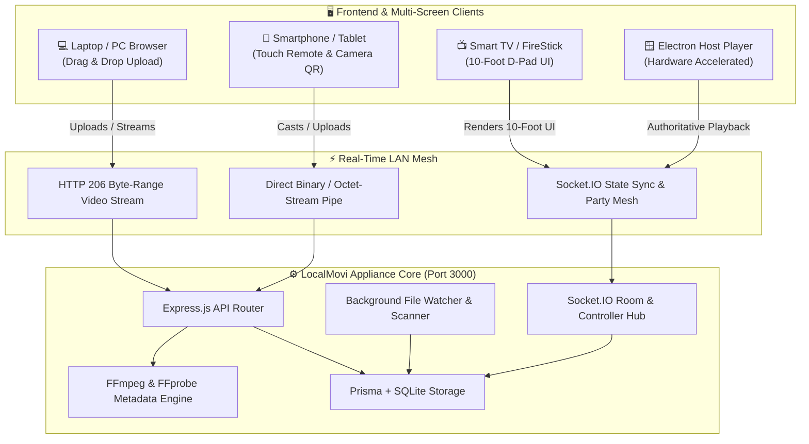
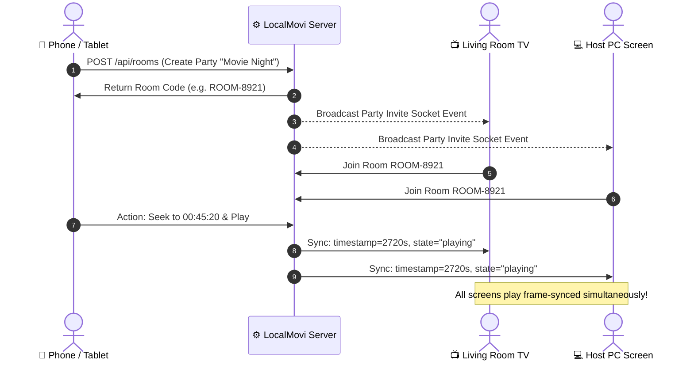

<div align="center">

```
  ██████╗ ███████╗██████╗  ██████╗     ██╗   ██╗██████╗ 
  ██╔══██╗██╔════╝██╔══██╗██╔═══██╗    ██║   ██║██╔══██╗
  ██████╔╝█████╗  ██████╔╝██║   ██║    ██║   ██║██████╔╝
  ██╔═══╝ ██╔══╝  ██╔══██╗██║   ██║    ╚██╗ ██╔╝██╔═══╝ 
  ██║     ███████╗██║  ██║╚██████╔╝     ╚████╔╝ ██║     
  ╚═╝     ╚══════╝╚═╝  ╚═╝ ╚═════╝       ╚═══╝  ╚═╝     
   L O C A L M O V I   •   T H E   L A N   C I N E M A
```

# 🎬 LOCALMOVI `v0.1.0 (Version 0)`
### *Your Ultra-Fast, Private Local Network Video Streaming Appliance & Watch Party Hub*

[](https://github.com/harshar007/localmovi)
[](LICENSE)
[](Dockerfile)
[](package.json)
[](vite.config.ts)
[](src/server/socket/socketManager.ts)
[](src/electron/main.ts)

<p align="center">
  <b>Turn any Laptop, PC, TV, Tablet, or Phone into a Private Cinema in under 3 seconds.</b><br>
  Zero Cloud. Zero Subscriptions. Pure 4K High-Bitrate LAN Power.
</p>

---

[⚡ Features](#-why-localmovi-is-built-different) • [🚀 Quick Start](#-quick-start) • [📐 Architecture](#-system-architecture) • [📱 Phone & Laptop Flow](#-imgbb-style-instant-movie-upload) • [🎮 Remote & Party](#-real-time-watch-parties--remote-casting) • [📡 API Reference](#-rest-api--websocket-matrix)

---

</div>

## 🌟 Why LocalMovi is Built Different

<table>
  <tr>
    <td width="50%">
      <h3>🚀 1. The Appliance Principle</h3>
      <p><b>INSTALL ➔ SELECT FOLDER ➔ READY</b></p>
      <p>Zero technical configuration. Automatically scans LAN adapters, binds the best reachable IPv4 address, and serves an on-screen QR code for instant phone camera connection.</p>
    </td>
    <td width="50%">
      <h3>📱 2. ImgBB-Style 1-Tap Upload</h3>
      <p><b>DRAG & DROP ANYWHERE OR TAP FROM PHONE</b></p>
      <p>Have a movie on your phone gallery or laptop? Drag and drop it anywhere onto the screen or tap <b>START UPLOADING</b> to stream or host a Watch Party across the room.</p>
    </td>
  </tr>
  <tr>
    <td width="50%">
      <h3>🎉 3. Sub-Second Watch Parties</h3>
      <p><b>WATCH TOGETHER ACROSS ALL SCREENS</b></p>
      <p>Real-time authoritative drift correction with Socket.IO. When the host pauses, seeks, or changes speed, every connected phone, tablet, and smart TV stays frame-locked.</p>
    </td>
    <td width="50%">
      <h3>🎮 4. Cast-to-PC & FireStick TV UI</h3>
      <p><b>PHONE IS YOUR REMOTE • TV IS YOUR CINEMA</b></p>
      <p>Tap <b>Play on PC</b> from your smartphone and your device transforms into a touch-first tactile remote control with volume scrubbing, seek dial, and fullscreen controls.</p>
    </td>
  </tr>
</table>

---

## 📐 System Architecture



---

## 🚀 Quick Start

### 🐳 Option A: 1-Line Docker Launch (Recommended)
You can spin up LocalMovi as an independent private appliance in seconds:

```bash
# Clone the repository
git clone https://github.com/harshar007/localmovi.git
cd localmovi

# Build and start container
docker-compose up -d --build
```
> Open **`http://localhost:3000`** on your host PC or **`http://<YOUR-LAN-IP>:3000`** on any phone / tablet / TV on the same Wi-Fi.

---

### 💻 Option B: Native Windows / Linux Development

#### Prerequisites
- **Node.js**: v18+ (tested on Node v20/v24)
- **FFmpeg**: Bundled automatically or installed in system PATH
- **Git**: Installed

#### 1. Setup & Install Dependencies
```bash
# Install packages
npm install

# Initialize Prisma SQLite database schema
npm run prisma:generate
npm run prisma:push
```

#### 2. Run in Development Mode
```bash
# Concurrently starts backend server (Port 3000) & Vite frontend
npm run dev
```

#### 3. Run Native Electron Desktop Player
```bash
# Launch Electron Host Player
npm run dev:electron
```

#### 4. Build Production Distribution
```bash
# Build Vite Client, TypeScript Server, and Electron Process
npm run build

# Package standalone Windows Installer (.exe)
npm run dist
```

---

## 📤 ImgBB-Style Instant Movie Upload

LocalMovi features a frictionless upload and sharing experience inspired by **ImgBB**:

```
 ┌────────────────────────────────────────────────────────────────────────┐
 │                      Upload and share movies                           │
 │     Drag and drop anywhere to start uploading your video file          │
 │                                                                        │
 │                      ┌────────────────────────┐                        │
 │                      │  🚀  START UPLOADING   │                        │
 │                      └────────────────────────┘                        │
 │                                                                        │
 │   Supported: [MP4]  [MKV]  [MOV]  [WebM]  [AVI]  [4K UHD]  [1080p]     │
 └────────────────────────────────────────────────────────────────────────┘
```

1. **Laptop / PC**: Simply drag any `.mp4`, `.mkv`, or `.mov` from File Explorer straight into the browser window.
2. **Mobile / Phone**: Tap **Upload Movie** ➔ **START UPLOADING** to pick directly from your **Phone Gallery**, **Files**, or **Downloads**.
3. **Instant Streaming**: Videos are indexed in real-time with FFprobe metadata and thumbnail generation.

---

## 🎮 Real-Time Watch Parties & Remote Casting



---

## 📡 REST API & WebSocket Matrix

### 🎬 Media & Upload Endpoints
| Method | Endpoint | Description | Auth |
| :--- | :--- | :--- | :--- |
| `GET` | `/api/media` | List media library with search, folder, resolution filters | Public / Token |
| `POST` | `/api/media/upload` | Stream upload video file with custom `x-filename` header | Public |
| `GET` | `/api/media/:id` | Get single media metadata, duration, resolution, progress | Public / Token |
| `GET` | `/api/media/:id/stream` | RFC 7233 HTTP 206 Byte-range direct video streaming | Public |
| `GET` | `/api/media/:id/thumbnail`| Cached poster frame jpeg | Public |
| `PATCH`| `/api/media/:id/favorite` | Toggle favorite flag | Token |
| `POST` | `/api/media/:id/progress` | Save per-device playback resume position | Token |

### 👥 Watch Party & Rooms
| Method | Endpoint | Description |
| :--- | :--- | :--- |
| `GET` | `/api/rooms` | List active LAN Watch Party rooms |
| `POST` | `/api/rooms` | Create a new room with host media |
| `GET` | `/api/rooms/:id` | Get room state, members, and current timestamp |
| `POST` | `/api/rooms/:id/sync` | Authoritative sync of room playback state |
| `DELETE`| `/api/rooms/:id` | End/delete room (by room creator/admin) |

### ⚡ Socket.IO Real-time Events
| Event Channel | Payload | Description |
| :--- | :--- | :--- |
| `remote:command` | `{ command, position, volume, speed }` | Remote command dispatch to Host player |
| `host:state_update`| `{ state, position, duration, media }` | Host PC authoritative state broadcast |
| `party:invite` | `{ roomId, roomCode, roomName, media }` | LAN-wide notification banner broadcast |
| `room:sync` | `{ roomId, state, position }` | Clock drift synchronization for watch parties |

---

## 📁 Repository Structure

```
localmovi/
├── prisma/
│   └── schema.prisma              # SQLite models (Media, Folder, Session, Room, Device)
├── src/
│   ├── client/                    # React 18 + TypeScript + Vite + Tailwind CSS
│   │   ├── api/                   # Typed REST apiClient & XHR uploaders
│   │   ├── components/            # VideoPlayer, VideoUploadModal, RemoteControl, Navbar
│   │   ├── context/               # AuthContext, SocketContext
│   │   └── pages/                 # HomePage, LibraryPage, WatchPage, RemotePage, RoomsPage
│   ├── server/                    # Node.js + Express + Socket.IO Backend
│   │   ├── controllers/           # Media, Folder, Remote, Room, System, Auth
│   │   ├── services/              # Streaming, FFmpeg, Scanner, System, Logger
│   │   ├── socket/                # SocketManager & Room mesh
│   │   └── index.ts               # Express entrypoint with dynamic port fallback
│   ├── electron/                  # Electron Main Process & Preload IPC
│   └── shared/                    # Shared TypeScript contracts & Socket protocols
├── Dockerfile                     # Optimized multi-stage Docker build
├── docker-compose.yml             # 1-command Docker deployment
├── package.json
├── vite.config.ts
└── README.md
```

---

## 🛡️ Security & Privacy Principle
- **100% Offline-First:** Operates on private LAN networks. No third-party tracking, analytics, or external cloud relays.
- **Path Traversal Protection:** Raw filesystem paths are never leaked to clients and are shielded behind UUIDs.
- **Safe Electron Sandbox:** Configured with `contextIsolation: true`, `nodeIntegration: false`, and explicit IPC bridge boundaries.

---

<div align="center">

**Built with ❤️ for private, super-fast local movie streaming.**  
⭐ Star this repo on GitHub if you love self-hosted private software!

</div>
